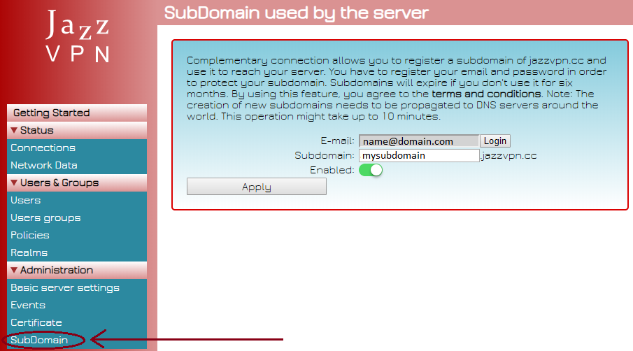
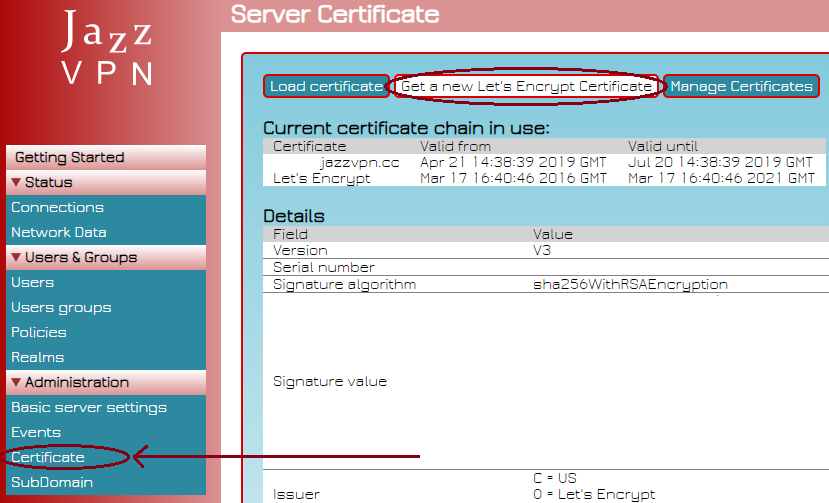

After reading this document, you should be able to set up a fully working JazzVPN server.

## Installation

To install JazzVPN, download setup package and execute it in the server you want to run it. The installation is straightfoward. You will need to set server admin username and password. This credentials will be used later for server administration.

## Initial Configuration 

Once setup finished, server needs to be configured. Open your favorite browser and navigate to [https:\\\\localhost](https:\\localhost). An alert will show up saying that the certificate is invalid. Thant's fine, we didn't set the certificate yet. To bypass invalid certificate warning, most browsers have an option to choose advanced settings, and later proceed to enter the site. Next you'll see a login prompt.

The username and password you choose at installation time should be used here. Once you logged in, a url for remote access has to be defined and server certificate has to be put in place.

### Url for remote access

There are basically two options to have a server access url. The simpler and faster one will be getting a complementary connection subdomain for free under jazzvpn.cc. This can be done by going to SubDomain menu and registering a user and later choosing a subdomain. 

User registration is used to keep the subdomain exclusive to the registering user. Second option is registering an Internet domain and setting IP address to the fixed address your ISP has set to you.

You have to be able to use the URL to access your server from your browser. If you just registered for a jazzvpn.cc subdomain, wait 10 minutes for the new domain to propagate across the servers around the world. It might be the case in a business or home configuration that Internet connection is through a router which separates public network from private network (LAN) and your server is part of the LAN. If that's the case, you need to redirect port 443 from your router to your server (also known as port forwarding). Check your router manuals to see how to do this. 

### Certificate

Once the server has a fixed URL that can be used to connect to the server, a certificate has to be set. The easiest way to do this is by using a free [Let's Encrypt](https://www.letsencrypt.org) certificate. JazzVPN has a build in client for Let's Encrypt certificate generation and renewal.  

By selecting to create a new Let's Encrypt certificate, a number of fields will be prompted that are common for a certificate signature request. Common Name doesn't have to be filled as long as DNS alias has some value. Contact email and acceptance of Terms of Service are required for certificate generation. Client will try to validate server URL using tls-alpn-01 validation method. Once the certificate was created you don't need to restart the server.

On the other hand, you can upload your own certificate using Load Certificate button next to Get a new Let's Encrypt certificate.

Verify that the certificate is valid by accessing the server using a browser. There should be a padlock next to the URL and, by click on it, the certificate loaded to JazzVPN shoud be visible and identified as valid. JazzVPN client will pursue a though validation of the certificate in order to make sure it is connecting to the server it pretends to and there is no man in the middle intercepting the connection. An invalid certificate will result in a connection error and a general description of the error.

## Network setup

Once the server is ready to receive connections, it has to know how to handle those connections. JazzVPN supports the creation of many networks, called realms, an heritage from using Kerberos protocol as the basis for user authentication. For a connection to take place, at least one realm has to exist, so first of all a realm has to be created. On realm creation. Client is allowed to define IPv4 and IPv6 range for the network. It's important here to choose the correct authentication method: internal user database or Active Directory. In the future more methods will be available here. With the realm created, move to Users and start creating the users you need for your network. In case you are using Active Directory as authentication method, it can be choosed in Basic server settings if Active Directory users should be auto-imported or not.

Now you shoud be able to make a basic use of JazzVPN server. You can move to next document [Users](users.md) to understand how to create users.